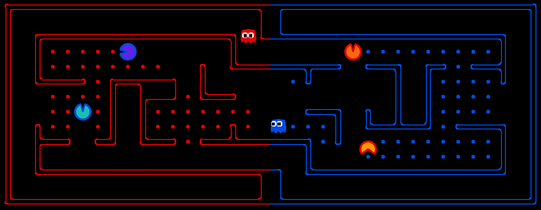
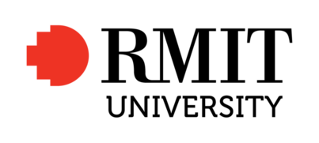
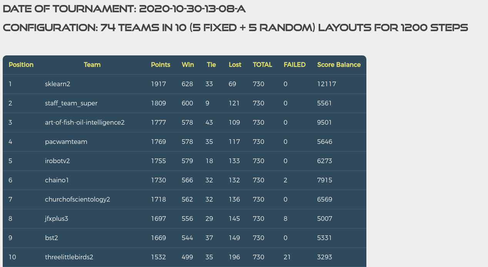

# Sklearn2 Pacman replay - RMITAI2020

---

**NOTE:** This repository **only contains replays** of `sklearn2` team - RMITAI2020. Presentation video might be included later after marking results.

---

**Course:** [COSC1125/1127 Artificial Intelligence](http://www1.rmit.edu.au/courses/004123) @ Semester 2, 2020

**Instructor:** Prof. Sebastian Sardina

<p align="center"> 
    
    
 </p>

### Result

The included replays is downloaded from the last final tourament (`2020-10-30-13-08-A`) runs with 74 teams in 10 map (5 fixed, 5 random) with a maximum time of 1200 steps.

The result of top 10 are as follow where our team come 1st place with a Reinforcement Learning agent.



For a full list of team, archieve results available at `/results/results_2020-10-30-13-08-a`

### Requirements

`python3` and `tkinter`.

### How to run

```bash
chmod +x play-replays.sh
./play-replays.sh replays
```

**Note:** the `play-replays.sh` script has been modified to only show `sklearn2`. Feel free to modify to see other teams.

### The team

The project was done with [187 hours](https://wakatime.com/@f273bdce-0778-447a-b6e4-3ea0d2e83cd9/projects/czubnirwlk?start=2020-11-02&end=2020-11-08) individually and a total 308 commits of these contributors:

- Don Phu ([@DonneyDucka](https://github.com/DonneyDucka))

- David Vo ([@thedavidvo](https://github.com/thedavidvo))

- Austin Pham (Thang Pham) ([@rockmanvnx6](https://github.com/rockmanvnx6))

### Acknowledgements

This is [Pacman Capture the Flag Contest](http://ai.berkeley.edu/contest.html) from the set of [UC Pacman Projects](http://ai.berkeley.edu/project_overview.html).  We are very grateful to UC Berkeley CS188 for developing and sharing their system with us for teaching and learning purposes.
